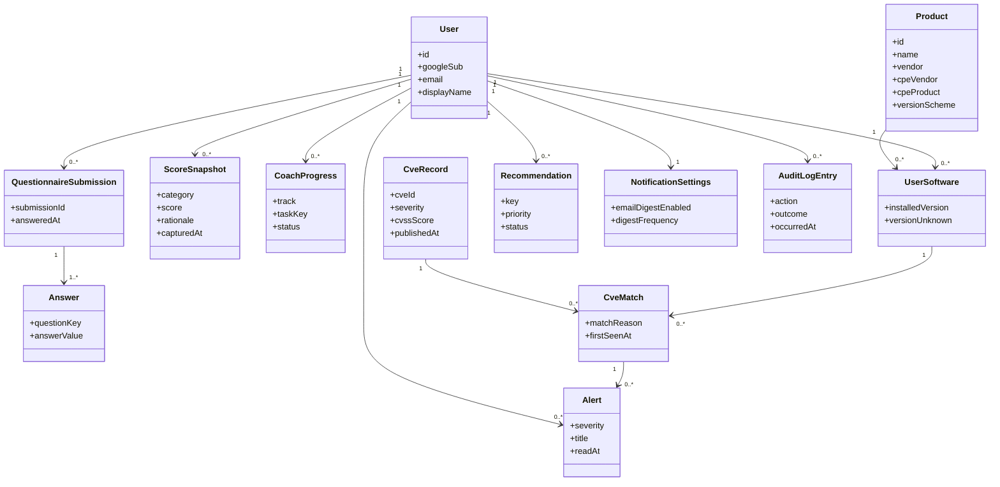

# Soteria class list (noun extraction for CRC cards)

Course artifact supporting **Milestone 4**. The nouns in the 38 user stories
(`CybersecurityAppUserStories.md`) are extracted here, de-duplicated, and mapped
to:

- their **kind** — _entity_ (identity + persisted state), _value object_
  (immutable descriptor, no identity), or _service_ (behaviour, little or no
  state);
- their **table** in [`data-model.md`](data-model.md), if they are persisted;
- their **module** in the codebase;
- **responsibilities** and **collaborators**, so each row can become a CRC card.

Nouns that are pure UI chrome (button, card, tab, chip, bell icon) are covered by
the design system (INF-03) and are not domain classes; they are omitted.

This document is the class list. There is no separate `classes` section in
[`components.md`](components.md); that file covers the four engines in depth and
this file covers the whole noun set.

## 1. Domain class diagram

## 2. Noun → class map

### 2.1 Persisted entities

| Noun (from stories)                                 | Kind                                 | Table                                                  | Module                                 | Stories                    |
| --------------------------------------------------- | ------------------------------------ | ------------------------------------------------------ | -------------------------------------- | -------------------------- |
| User / account / "my profile"                       | entity                               | `users`                                                | `server/src/users/`                    | US-14, US-15, US-20        |
| Google sign-in session                              | entity (transient, not in DB)        | —                                                      | `server/src/auth/session.ts`           | US-14                      |
| Questionnaire submission ("one sitting")            | entity                               | `questionnaire_responses` (grouped by `submission_id`) | `server/src/questionnaire/`            | US-16, US-19               |
| Answer (to a question)                              | entity                               | `questionnaire_responses` (row)                        | `server/src/questionnaire/`            | US-16, US-18               |
| Category score / posture score                      | entity                               | `score_snapshots`                                      | `shared/src/scoring/engine.ts`         | US-17, US-19               |
| Score history / posture over time / change log      | entity (view over `score_snapshots`) | `score_snapshots`                                      | `server/src/scoring/history.ts`        | US-19                      |
| Coach progress / adoption progress / completed step | entity                               | `coach_progress`                                       | `server/src/coach/`                    | US-08, US-10, US-12        |
| Product / operating system / browser / desktop app  | entity                               | `products` (catalog)                                   | `shared` catalog (INF-07)              | US-21, US-22               |
| Software profile entry / installed software         | entity                               | `user_software`                                        | `server/src/software/`                 | US-21, US-23, US-28        |
| CVE record / vulnerability                          | entity                               | `cve_cache`                                            | `server/src/cve/cveCache.ts`           | US-24, US-25, US-34        |
| CVE match / finding                                 | entity                               | `cve_matches`                                          | `server/src/cve/matcher.ts`            | US-24, US-25, US-29, US-36 |
| Recommendation / prioritized action                 | entity                               | `recommendations`                                      | `shared/src/recommendations/engine.ts` | US-27, US-28, US-29, US-30 |
| Alert / in-app CVE alert                            | entity                               | `alerts`                                               | `server/src/alerts/`                   | US-31, US-35               |
| Notification settings / email digest opt-in         | entity                               | `notification_settings`                                | `server/src/notifications/`            | US-11, US-12, US-32        |
| Audit log entry                                     | entity                               | `audit_log`                                            | `server/src/db/audit.ts` (INF-08)      | US-14, US-20, US-29, US-31 |

### 2.2 Value objects (no identity; not stored on their own)

| Noun                                                   | Kind         | Lives in / on                                                                    | Stories             |
| ------------------------------------------------------ | ------------ | -------------------------------------------------------------------------------- | ------------------- |
| Password / candidate password                          | value object | browser memory only — **never persisted, never sent to the API**                 | US-01, US-02, US-04 |
| Passphrase                                             | value object | browser memory only                                                              | US-03               |
| Generated credential                                   | value object | browser memory only                                                              | US-02, US-03        |
| Strength estimate (score, crack time, warning)         | value object | `@zxcvbn-ts/core` result, browser only                                           | US-04               |
| Breach status / breach count / "not found"             | value object | browser only, from the HIBP range response                                       | US-01, US-04, US-13 |
| SHA-1 hash prefix (5 chars) + suffix                   | value object | browser only                                                                     | US-01, US-05        |
| Question                                               | value object | `shared/src/scoring/questions.ts` constant                                       | US-16, US-18        |
| Answer option (with weight)                            | value object | `shared/src/scoring/questions.ts`                                                | US-16, US-17        |
| Contribution (to a score)                              | value object | `ScoreResult.categories[].contributions[]`                                       | US-18               |
| CVSS score / severity                                  | value object | field on `cve_cache` / `NvdCve`                                                  | US-25, US-36        |
| Match confidence (`exact`/`possible`/`unknown`)        | value object | `match_reason` on `cve_matches`; `RangeVerdict` in `shared/src/cve/version.ts`   | US-23, US-24, US-25 |
| CPE range (`versionStart/EndIncluding/Excluding`)      | value object | `shared/src/cve/version.ts`                                                      | US-24               |
| Installed version / version string                     | value object | `installed_version` on `user_software`                                           | US-22, US-23, US-28 |
| "Unknown version" marker                               | value object | `version_unknown` bit on `user_software`                                         | US-23               |
| Plain-language CVE summary                             | value object | `plain_language` on `cve_cache`; templated by `shared/src/cve/plain-language.ts` | US-25               |
| Official link / NVD reference / vendor advisory        | value object | `references_json` on `cve_cache`; `vendor_advisory_url` on `products`            | US-26               |
| Priority (urgency, benefit, effort)                    | value object | fields on `recommendations`; computed by the engine                              | US-27               |
| Dismiss reason                                         | value object | `dismissed_reason` on `recommendations`                                          | US-29               |
| Data freshness / staleness / "last updated"            | value object | derived from `cve_refresh_runs` + `fetched_at`                                   | US-34               |
| Finding filter (product, severity, confidence, status) | value object | URL query string ↔ `GET /api/findings` params                                    | US-36               |
| Unsubscribe token / signed link                        | value object | `notification_settings` (unsubscribe token)                                      | US-32               |
| Email digest (grouped message)                         | value object | rendered on the fly by `server/src/email/`                                       | US-32, US-33        |

### 2.3 Services (behaviour; orchestrated by the API)

| Noun / capability                            | Kind    | Module                                                             | Detail                                                                                   |
| -------------------------------------------- | ------- | ------------------------------------------------------------------ | ---------------------------------------------------------------------------------------- |
| Breach check                                 | service | `client/src/password/breachCheck.ts`                               | Browser-only; see [ADR 0007](adr/0007-browser-only-hibp-breach-check.md)                 |
| Password generator                           | service | `shared/src/password/generate.ts`                                  | Rejection sampling on `crypto.getRandomValues` (US-02)                                   |
| Passphrase generator                         | service | `shared/src/password/passphrase.ts`                                | EFF large wordlist (US-03)                                                               |
| Strength estimator                           | service | `client` glue over `@zxcvbn-ts/core`                               | [ADR 0008](adr/0008-client-side-strength-zxcvbn.md)                                      |
| Password-manager coach / chooser / checklist | service | `shared/src/coach/content.ts` + `server/src/coach/`                | 3-question chooser → neutral shortlist → checklist (US-06, US-07, US-09)                 |
| Compromised-password response planner        | service | `shared/src/coach/response.ts`                                     | Ordered next steps for a breached result (US-13)                                         |
| Scoring engine                               | service | `shared/src/scoring/engine.ts`                                     | [`components.md`](components.md) §1                                                      |
| NVD client                                   | service | `server/src/cve/nvdClient.ts`                                      | Token bucket, backoff, `NVD_API_KEY` ([ADR 0009](adr/0009-nvd-cve-api-external-data.md)) |
| CVE matcher                                  | service | `server/src/cve/matcher.ts` + `shared/src/cve/version.ts`          | [`components.md`](components.md) §2                                                      |
| Version comparator                           | service | `shared/src/cve/version.ts`                                        | Per-`versionScheme` ordering                                                             |
| Recommendation engine                        | service | `shared/src/recommendations/engine.ts`                             | [`components.md`](components.md) §3                                                      |
| Alert generator / refresh job                | service | `server/src/jobs/refreshJob.ts` + `shared/src/alerts/generator.ts` | [`components.md`](components.md) §4                                                      |
| Dashboard aggregator                         | service | `server/src/dashboard/` (`GET /api/dashboard`)                     | Single aggregate to avoid request waterfall (US-35)                                      |
| Account deletion / cascade                   | service | `server/src/users/deleteAccount.ts`                                | Ordered transactional delete (US-20; see [`data-model.md`](data-model.md))               |
| Audit logger                                 | service | `server/src/db/audit.ts`                                           | INF-08; no payloads                                                                      |
| Session issuer / verifier                    | service | `server/src/auth/session.ts`                                       | httpOnly JWT cookie, `token_version` (US-14)                                             |

## 3. CRC cards for the core classes

Format: **Responsibilities** | **Collaborators**.

### Entity: User

- **R:** Hold the Google identity (`google_sub`, `email`, `display_name`) and
  account timestamps. Own every posture record. Be the single cascade root for
  deletion.
- **C:** Session issuer, QuestionnaireSubmission, ScoreSnapshot, CoachProgress,
  UserSoftware, Recommendation, Alert, NotificationSettings, Account deletion
  service.

### Entity: QuestionnaireSubmission

- **R:** Group the Answers given in one sitting under one `submission_id`. Mark
  when the questionnaire was completed. Be the unit of history for US-19.
- **C:** Answer, Question (validation), Scoring engine, ScoreSnapshot.

### Value object: Answer

- **R:** Record one chosen option for one question. Carry the option weight into
  scoring. Never exist without a submission.
- **C:** Question, AnswerOption, Scoring engine.

### Entity: ScoreSnapshot

- **R:** Store one category's score (0–100) and its one-line rationale at a point
  in time. Be append-only so the sparkline has a series. Coalesce to at most one
  per user per hour.
- **C:** Scoring engine, QuestionnaireSubmission, CveMatch, CoachProgress,
  Score history view.

### Value object: Contribution

- **R:** Explain one component of a category score: source id, label, signed
  delta, plain-language reason. Feed US-18's expandable card with no client-side
  logic.
- **C:** Scoring engine, ScoreSnapshot, Recommendation engine.

### Entity: Product (catalog)

- **R:** Describe one supported product: display name, vendor, category, CPE
  vendor/product, version scheme, version-lookup help, vendor advisory URL. Be
  shared reference data, not user-owned.
- **C:** UserSoftware, NVD client, CVE matcher, Version comparator.

### Entity: UserSoftware (software profile entry)

- **R:** Record that a user has a Product installed, at a known version or
  explicitly unknown. Trigger matching on add/change. Cap at 30 per user.
- **C:** Product, CVE matcher, ScoreSnapshot, Recommendation engine.

### Entity: CveRecord (cache)

- **R:** Hold a normalised NVD record: id, dates, CVSS score/severity, summary,
  plain-language summary, references, CPE ranges. Be shared across users. Carry
  `fetched_at` for freshness.
- **C:** NVD client, CVE matcher, Plain-language templater, Data freshness.

### Entity: CveMatch (finding)

- **R:** Join one UserSoftware to one CveRecord with the `match_reason` string
  shown to the user and the first-seen timestamp. Be unique per
  `(user_software_id, cve_id)`. Be the source of alerts and of the
  software-exposure score.
- **C:** UserSoftware, CveRecord, Version comparator, Alert generator, Scoring
  engine, Recommendation engine.

### Value object: MatchConfidence

- **R:** Classify a match as `exact`, `possible`, or `unknown` and explain why in
  one sentence. Gate whether a match can alert or lower a score (`unknown` never
  does).
- **C:** Version comparator, CPE range, CVE matcher, Alert generator.

### Entity: Recommendation

- **R:** State one concrete action with `why`/`how` text, a stable `key`,
  urgency/benefit/effort, and a computed `priority`. Preserve `status`
  (`open`/`done`/`dismissed`) across regeneration. Carry a dismiss reason and
  resolution timestamp for the history tabs.
- **C:** Recommendation engine, ScoreSnapshot, CveMatch, CoachProgress, Audit
  logger.

### Entity: Alert

- **R:** Notify one user that a new `exact`/`possible` match appeared. Track
  read/dismissed state. Drive the band-1 bell's unread count.
- **C:** Alert generator, CveMatch, User, NotificationSettings.

### Service: Scoring engine

- **R:** Pure function from (answers, findings, coach progress) to five category
  scores + overall, each with its contributions. Deterministic and total.
- **C:** Question set, Answer, SoftwareFinding, CoachProgressItem, Contribution,
  ScoreSnapshot, Recommendation engine.

### Service: CVE matcher

- **R:** Fetch/cache NVD data per catalog product; evaluate cached CPE ranges
  against a user's version; classify and persist matches; never query
  non-catalog products; never call an unknown version `exact`.
- **C:** NVD client, CveRecord cache, Version comparator, Product, UserSoftware,
  CveMatch.

### Service: Recommendation engine

- **R:** Pure function producing a ranked, deduplicated recommendation set with
  stable keys; a critical CVE outranks any questionnaire item; completed coach
  steps do not regenerate.
- **C:** ScoreResult, findings, CoachProgressItem, Answer, Recommendation.

### Service: Alert generator (refresh job)

- **R:** On a schedule, refresh the cache, re-match every user, and raise exactly
  one alert per genuinely new match, skipping dismissed decisions; be idempotent;
  audit every run; set the freshness error on failure.
- **C:** NVD client, CVE matcher, `deriveAlerts` (pure), Alert, ScoreSnapshot,
  Audit logger, Data freshness.

### Service: Account deletion

- **R:** In one transaction, delete `alerts`, then `cve_matches` for the user's
  software, then the `users` row (cascading the rest), then write an
  `audit_log` row with a null `user_id`. Bump `token_version` first to kill the
  session.
- **C:** User, Session issuer, Audit logger, every user-owned entity.
