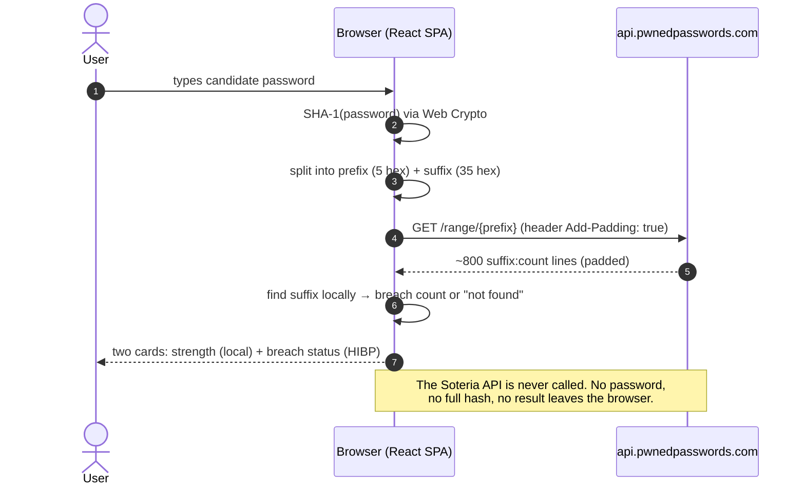
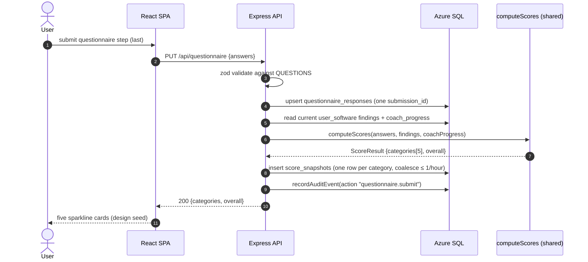
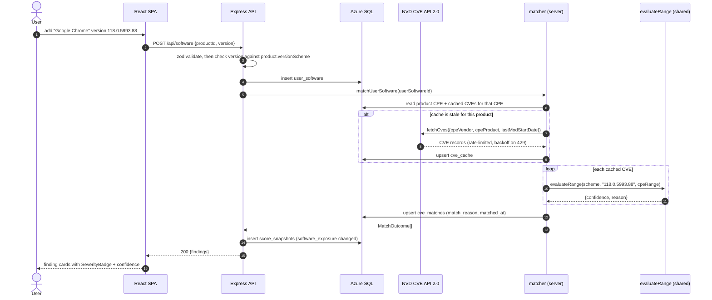
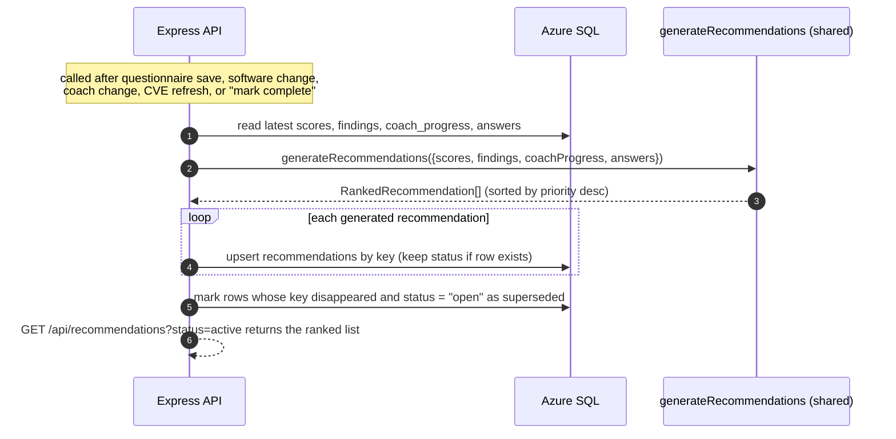
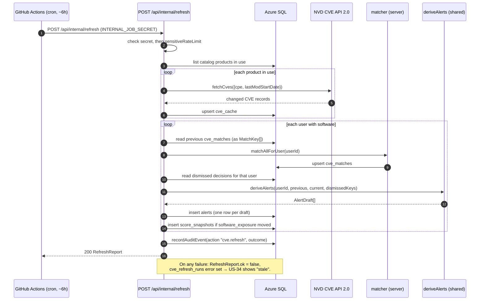
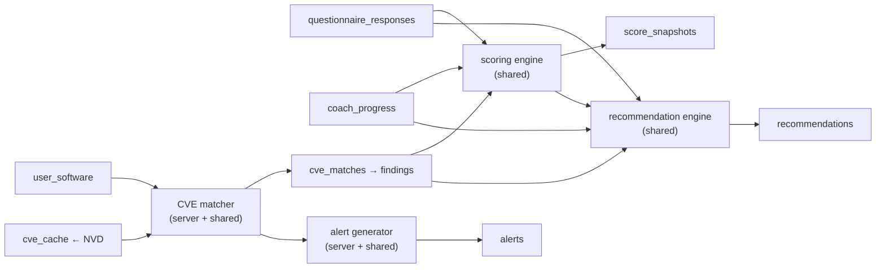

# Soteria component design

Course artifact for **Milestone 4 (component design)**. It specifies the four
engines that carry Soteria's domain logic — the **scoring engine**, the **CVE
matcher**, the **recommendation engine**, and the **alert generator** — with
their interfaces as TypeScript signatures and their runtime behaviour as Mermaid
sequence diagrams.

Conventions used here:

- Pure, I/O-free rule modules live in `@soteria/shared` (`shared/src/...`) and are
  imported by both tiers. Modules that touch the network or the database live in
  `server/src/...`. The implementation plan writes these paths in shorthand
  (`shared/scoring/engine.ts`); the real files sit under `shared/src/`.
- Signatures are the contract. They will move slightly in implementation, but the
  shape — pure core, thin I/O shell — does not.
- Persisted columns follow [`data-model.md`](data-model.md). Where a lifecycle
  field (resolved, dismissed) is needed, it lives on `recommendations`, which has
  `status`, `dismissed_reason`, and `resolved_at`; `cve_matches` itself stays a
  thin join row (`match_reason`, `first_seen_at`, `matched_at`).
- No diagram shows a password or full password hash reaching the Soteria API. See
  [ADR 0007](adr/0007-browser-only-hibp-breach-check.md) /
  [ADR 0008](adr/0008-client-side-strength-zxcvbn.md).

The five score categories used throughout are `password_hygiene`,
`breach_preparedness`, `mfa`, `software_exposure`, and `update_habits` (US-17).

---

## 0. Reference: the private breach check (no server component)

Included because it is the load-bearing privacy invariant, not because it has a
server component — it has none.



---

## 1. Scoring engine

**Module:** `shared/src/scoring/engine.ts` (pure) + `shared/src/scoring/questions.ts`
(question set).
**Consumed by:** `server` on questionnaire save, software change, coach change,
recommendation completion, and CVE refresh (US-16, US-17, US-19).
**Documented in plain language by:** `docs/architecture/scoring.md` (US-17, later
phase).

### Responsibilities

- Turn a set of questionnaire answers, the user's current CVE findings, and their
  coach progress into five category scores (0–100) and one overall score.
- Emit, for every score, the list of individual contributions that produced it,
  each with a human-readable reason, so US-18 can explain the number without any
  logic in the client.
- Be deterministic and total: defined output for no answers, all-best, and
  all-worst.

### Interface

```ts
// shared/src/scoring/questions.ts
export type CategoryKey =
  | "password_hygiene"
  | "breach_preparedness"
  | "mfa"
  | "software_exposure"
  | "update_habits";

export interface AnswerOption {
  id: string;
  label: string;
  /** Points this option contributes toward its question's category, before weighting. */
  weight: number;
}

export interface Question {
  id: string;
  category: CategoryKey;
  prompt: string;
  helpText: string;
  options: AnswerOption[];
}

export const QUESTIONS: readonly Question[];

// shared/src/scoring/engine.ts
export interface Answer {
  questionId: string;
  optionId: string;
}

/** Neutral summary of the user's CVE findings; keeps the engine independent of the DB. */
export interface SoftwareFinding {
  userSoftwareId: string;
  productName: string;
  confidence: "exact" | "possible" | "unknown";
  severity: "critical" | "high" | "medium" | "low" | "none";
  status: "active" | "resolved" | "dismissed";
}

export interface CoachProgressItem {
  track: string;
  taskKey: string;
  status: "not_started" | "in_progress" | "done" | "skipped";
}

export interface Contribution {
  /** Stable id of the thing that moved the score: a question id, a finding id, a coach task key. */
  sourceId: string;
  label: string;
  /** Signed points this contribution added to the category (post-weighting). */
  delta: number;
  reason: string;
}

export interface CategoryScore {
  key: CategoryKey;
  score: number; // 0–100, clamped
  contributions: Contribution[];
}

export interface ScoreResult {
  categories: CategoryScore[]; // always length 5, fixed order
  overall: number; // 0–100, weighted mean of categories
}

export function computeScores(
  answers: Answer[],
  softwareFindings: SoftwareFinding[],
  coachProgress: CoachProgressItem[],
): ScoreResult;
```

### Rules (summary; full text in `scoring.md`)

- Each category starts from its questionnaire sub-score: sum of answered option
  weights ÷ sum of max weights, scaled to 0–100.
- `software_exposure` is then adjusted down by active CVE findings (weighted by
  severity and confidence — `possible` counts less than `exact`, `unknown`
  contributes a small fixed penalty per US-23). With no software profile it uses
  a neutral value and says so in a contribution.
- `mfa` and `password_hygiene` receive positive contributions from completed
  coach steps (US-07, US-12).
- `overall` is the mean of the five categories; every category is weighted
  equally in Phase 1.
- Unanswered questions contribute a `delta` of 0 with reason "not answered yet"
  so US-18 can show the gap.

### Sequence: questionnaire submission triggers scoring



---

## 2. CVE matcher

**Modules:**

- `server/src/cve/nvdClient.ts` — NVD CVE API 2.0 client (token bucket, backoff,
  optional `NVD_API_KEY`).
- `server/src/cve/cveCache.ts` — read/write `cve_cache`.
- `server/src/cve/matcher.ts` — I/O shell: load candidates, call the pure
  comparator, persist `cve_matches`.
- `shared/src/cve/version.ts` — pure per-`versionScheme` version comparison and
  range evaluation.
- `shared/src/cve/plain-language.ts` — pure CVSS/CWE → plain-English templating
  (US-25).

**Policy documented in:** `docs/architecture/cve-matching.md` (US-24, later
phase) — the false-positive / false-negative rules and why a match is `possible`
rather than `exact`.

### Responsibilities

- For one catalog product, fetch the relevant CVEs from NVD (last ~2 years
  initially, then incremental by `lastModStartDate`) and cache the normalised
  record in `cve_cache`.
- For one `user_software` row, evaluate every cached CVE's CPE `cpeMatch` ranges
  against the user's version and classify the result `exact | possible |
unknown`.
- Persist one `cve_matches` row per `(user_software_id, cve_id)` with a
  `match_reason` string the UI shows verbatim ("Chrome 118.0 is below the fixed
  version 119.0.6045.105").
- Never query a product that is not in the catalog. Never claim `exact` for an
  unknown-version entry (US-23).

### Interface

```ts
// shared/src/cve/version.ts
export type VersionScheme = "semver" | "build" | "marketing";

export interface CpeRange {
  exactVersion?: string;
  versionStartIncluding?: string;
  versionStartExcluding?: string;
  versionEndIncluding?: string;
  versionEndExcluding?: string;
}

export type MatchConfidence = "exact" | "possible" | "unknown";

export interface RangeVerdict {
  confidence: MatchConfidence;
  reason: string;
}

/** Pure. `userVersion === null` means the user marked the version unknown (US-23). */
export function evaluateRange(
  scheme: VersionScheme,
  userVersion: string | null,
  range: CpeRange,
): RangeVerdict;

export function compareVersions(
  scheme: VersionScheme,
  a: string,
  b: string,
): -1 | 0 | 1;

// server/src/cve/nvdClient.ts
export interface NvdCve {
  cveId: string;
  publishedAt: string;
  lastModifiedAt: string;
  cvssScore: number | null;
  severity: "critical" | "high" | "medium" | "low" | "none";
  summary: string;
  cvssVector: string | null;
  cweIds: string[];
  cpeRanges: Array<{ cpeVendor: string; cpeProduct: string } & CpeRange>;
  references: Array<{ url: string; tags: string[] }>;
}

export interface NvdQuery {
  cpeVendor: string;
  cpeProduct: string;
  lastModStartDate?: string; // ISO; omitted for the initial 2-year backfill
}

export function fetchCves(query: NvdQuery): Promise<NvdCve[]>;

// server/src/cve/matcher.ts
export interface MatchOutcome {
  cveId: string;
  confidence: MatchConfidence;
  matchReason: string;
  severity: NvdCve["severity"];
}

/** Loads cached CVEs for the product, runs evaluateRange, upserts cve_matches. */
export function matchUserSoftware(
  userSoftwareId: string,
): Promise<MatchOutcome[]>;

/** Full pass for one user: used by US-21 (profile change) and the refresh job. */
export function matchAllForUser(
  userId: string,
): Promise<Record<string, MatchOutcome[]>>;
```

### Confidence rules (summary)

| Situation                                                                 | Confidence |
| ------------------------------------------------------------------------- | ---------- |
| User version known, falls inside a CPE range or equals `exactVersion`     | `exact`    |
| User version known, scheme is `marketing` or the CPE lacks precise bounds | `possible` |
| User version known, pre-release / build string that cannot be ordered     | `possible` |
| User marked the version unknown (US-23)                                   | `unknown`  |

Only `exact` and `possible` matches feed alerts (§4) and the software-exposure
score (§1). `unknown` produces general update guidance only.

### Sequence: user adds software, matcher runs against the cache



---

## 3. Recommendation engine

**Module:** `shared/src/recommendations/engine.ts` (pure).
**Consumed by:** `server` after any scoring event; results upserted into
`recommendations` keyed by `key`, preserving `status` for keys that already
exist.
**Documented in plain language by:** `docs/architecture/recommendations.md`
(US-27, later phase).

### Responsibilities

- Take the current scores, CVE findings, coach progress, and questionnaire
  answers and produce a set of concrete, deduplicated recommendations.
- Assign each a `priority` from its urgency, benefit, and effort so the UI can
  present them in order (US-27).
- Be stable: the same inputs yield the same `key`s, so the server can upsert
  without losing a user's `done` / `dismissed` state, and completed coach steps
  do not regenerate.

### Interface

```ts
// shared/src/recommendations/engine.ts
import type { ScoreResult, Answer, CoachProgressItem } from "../scoring/engine";
import type { MatchConfidence } from "../cve/version";

export type RecommendationSource = "cve" | "questionnaire" | "coach";

export interface EngineInput {
  scores: ScoreResult;
  findings: Array<{
    key: string; // stable: `${productId}:${cveId}`
    productName: string;
    cveId: string;
    severity: "critical" | "high" | "medium" | "low" | "none";
    confidence: MatchConfidence;
    status: "active" | "resolved" | "dismissed";
  }>;
  coachProgress: CoachProgressItem[];
  answers: Answer[];
}

export interface Recommendation {
  key: string; // stable identity for upsert
  category: RecommendationSource;
  title: string;
  why: string;
  how: string;
  urgency: 1 | 2 | 3 | 4 | 5;
  benefit: 1 | 2 | 3 | 4 | 5;
  effort: 1 | 2 | 3;
  source: RecommendationSource;
}

export interface RankedRecommendation extends Recommendation {
  /** priority = urgency * 2 + benefit - effort; ties broken by largest category gap. */
  priority: number;
}

export function generateRecommendations(
  input: EngineInput,
): RankedRecommendation[];
```

### Rules (summary)

- One recommendation per active `exact`/`possible` CVE finding; urgency scales
  with CVSS severity. A critical CVE outranks every questionnaire-derived item.
- One recommendation per weak questionnaire category, urgency from how far below
  target the category sits; "enable MFA on email" outranks "enable MFA on a
  forum" via the category-gap tie-break.
- One recommendation per unfinished high-value coach step (US-10). A step whose
  `coach_progress.status` is `done` produces nothing.
- `resolved` / `dismissed` findings produce nothing; the server keeps their
  recommendation rows for the history tabs (US-30).

### Sequence: regeneration after a score change



---

## 4. Alert generator

**Modules:**

- `server/src/jobs/refreshJob.ts` — orchestrator behind
  `POST /api/internal/refresh` (secret-guarded, see
  [ADR 0010](adr/0010-github-actions-cron-scheduled-work.md)).
- `shared/src/alerts/generator.ts` — pure diff: given the previous and current
  match sets for a user, decide which alerts to raise.

**Consumed by:** the `cve-refresh.yml` GitHub Actions cron workflow, every ~6
hours.

### Responsibilities

- Refresh `cve_cache` for every catalog product that at least one user has in
  their profile, incrementally by `lastModStartDate`.
- Re-run the matcher for every user.
- For each newly appearing `exact`/`possible` match that is **not** already
  covered by a dismissed decision for that product/version, insert exactly one
  `alerts` row.
- Be idempotent: running the job twice with no new NVD data inserts no alerts.
- Write one `audit_log` row per run; on failure, set the freshness error that
  US-34 surfaces.

### Interface

```ts
// shared/src/alerts/generator.ts
export interface MatchKey {
  userSoftwareId: string;
  cveId: string;
  confidence: "exact" | "possible" | "unknown";
  severity: "critical" | "high" | "medium" | "low" | "none";
}

export interface AlertDraft {
  userId: string;
  cveMatchId: string;
  severity: MatchKey["severity"];
  title: string;
  body: string;
}

/** Pure. Returns drafts for matches present in `current` but not `previous`,
 *  excluding any `(userSoftwareId, cveId)` in `dismissedKeys`. `unknown` never alerts. */
export function deriveAlerts(
  userId: string,
  previous: MatchKey[],
  current: Array<MatchKey & { cveMatchId: string }>,
  dismissedKeys: ReadonlySet<string>,
): AlertDraft[];

// server/src/jobs/refreshJob.ts
export interface RefreshReport {
  productsRefreshed: number;
  usersRematched: number;
  alertsCreated: number;
  startedAt: string;
  finishedAt: string;
  ok: boolean;
  error: string | null;
}

export function runRefreshJob(): Promise<RefreshReport>;
```

### Sequence: scheduled refresh raises alerts



### Idempotency and dismissal

- `alerts` are keyed off `cve_match_id`; a match that already produced an alert
  is in `previous`, so `deriveAlerts` will not draft it again.
- A dismissed finding (US-29) puts `(userSoftwareId, cveId)` in `dismissedKeys`;
  a later refresh that re-derives the same match raises no alert, satisfying "a
  later refresh never resurrects a dismissed CVE for the same product/version".
- `unknown`-confidence matches never alert.

---

## 5. How the engines compose



Every arrow into `score_snapshots` is also a trigger for recommendation
regeneration and, on the scheduled path, for alert generation. The pure engines
never call each other directly — the server orchestrates them and passes the
database rows between them.
