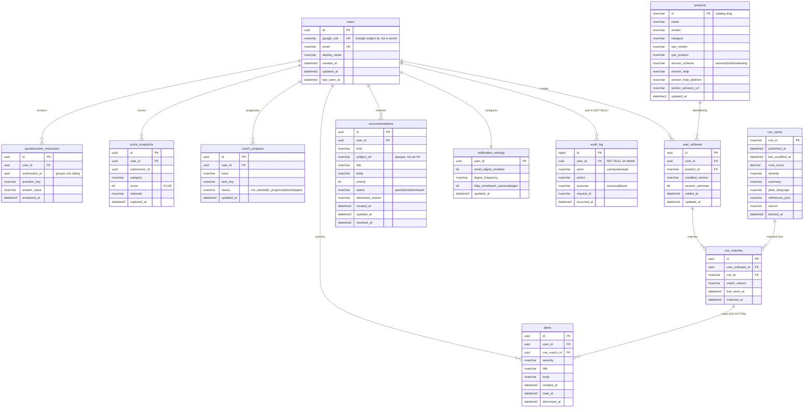

# Soteria data model

Delivered by **INF-04**. The schema lives in
`server/src/db/migrations/20260908090000_initial_schema.ts` and targets
**Azure SQL Database** in production and **SQL Server 2022 in Docker**
(`docker-compose.yml`) locally, through **Knex** with the **mssql** driver.

## Privacy invariants

These are the reason the schema looks the way it does. Every reviewer checks
them on every PR that touches `server/src/db`.

1. **No column holds a password, passphrase, generated credential, or hash —
   full or partial.** Password-derived data never leaves the browser: strength
   scoring runs locally with `@zxcvbn-ts/core`, and the breach check sends a
   5-character SHA-1 prefix straight from the browser to HIBP. The API is not in
   that path, so there is nothing to persist. The integration test
   `server/src/db/schema.integration.test.ts` asserts that no column in
   `INFORMATION_SCHEMA.COLUMNS` is named like
   `password|passphrase|secret|credential|hash|token`.
2. **Authentication stores an identifier, not a secret.** `users.google_sub` is
   Google's stable subject id. Sessions are httpOnly JWT cookies (US-14) and are
   never written to the database.
3. **Account deletion cascades everything user-owned.** Every user-owned table
   has `ON DELETE CASCADE` to `users`, except where SQL Server forbids a second
   cascade path (below).
4. **`audit_log` records that something happened, never what was in it.** There
   is no payload column. Its `user_id` is `ON DELETE SET NULL`, so the record of
   a deletion survives the deletion without identifying anyone.

## Entity relationship diagram



## Table notes

### `users`

One row per Google account. `google_sub` and `email` are unique. No password
column exists and none may be added; Soteria has no local credentials (US-14).

### `questionnaire_responses`

One row per answered question. `submission_id` groups the answers given in one
sitting, so history (US-19) is a list of submissions rather than a diff of
individual rows. Unique on `(submission_id, question_key)`.

### `score_snapshots`

Output of the scoring engine (US-17), one row per category per submission. Kept
append-only so the sparkline cards in the design seed have a real series to draw.
`rationale` holds the one-line "why" sentence shown on the card.

### `coach_progress`

Password-manager coach state (US-08, US-10). Unique on
`(user_id, track, task_key)`; `status` is constrained by a check constraint.

### `products`

The curated catalog from `shared/catalog/products.json` (INF-07), loaded by
`server/src/db/seeds/01_products.ts`. Not user-owned, so it is not cascaded.
`cpe_vendor`/`cpe_product` are indexed together because the CVE matcher (US-24)
looks products up by CPE.

### `user_software`

What a user says they have installed (US-21). `installed_version` is nullable and
paired with `version_unknown` so US-23 can distinguish "not answered" from
"answered: I don't know". `product_id` uses `NO ACTION` so a catalog entry cannot
be deleted while a user still references it.

### `cve_cache`

Server-side cache of NVD records (US-24, US-34). Shared across all users and not
user-owned. `fetched_at` drives the freshness display; `last_modified_at` is
indexed because the refresh job (US-31) pages by modification date.
`plain_language` holds the rewritten description (US-25).

### `cve_matches`

Join between a user's installed software and a cached CVE, with the
`match_reason` string the UI shows to explain why the match fired. Unique on
`(user_software_id, cve_id)`. Cascades from `user_software`, which cascades from
`users`.

### `recommendations`

Output of the recommendation engine (US-27..US-30). `subject_ref` is deliberately
an opaque string rather than a foreign key: a recommendation stays reviewable
after the row that produced it is gone.

### `alerts`

In-app CVE alerts (US-31, US-35). Indexed on `(user_id, created_at)` for the bell
in header band 1.

### `notification_settings`

One row per user, primary key is the user id. Covers US-12 (HIBP enrollment
acknowledgement) and US-32 (email digests, stretch).

### `audit_log`

Append-only. Records auth events, deletions, dismissals, and refresh jobs as
`(user_id, actor, action, outcome, occurred_at)`. INF-08 writes to it. There is
no payload column by design.

## SQL Server cascade-path constraints

SQL Server rejects a schema where one row can be reached from a delete by more
than one cascade path. Two foreign keys are therefore `NO ACTION`:

| Foreign key                              | Rule        | Why                                                                               |
| ---------------------------------------- | ----------- | --------------------------------------------------------------------------------- |
| `user_software.product_id → products.id` | `NO ACTION` | `products` is catalog data; a product in use must not be deletable.               |
| `cve_matches.cve_id → cve_cache.cve_id`  | `NO ACTION` | Cache eviction must not silently drop a user's match history.                     |
| `alerts.cve_match_id → cve_matches.id`   | `NO ACTION` | `alerts` and `cve_matches` both reach `users`; a second cascade path is rejected. |

Account deletion (US-20) therefore deletes in this order inside one transaction:

1. `alerts` for the user
2. `cve_matches` for the user's `user_software` rows
3. `delete from users where id = ?` — cascades everything else
4. write an `audit_log` row with `action = 'account.delete'` and a null `user_id`

## Running it

```sh
docker compose up -d sql          # local SQL Server 2022
cp .env.example .env              # set DATABASE_URL (see the comments there)
npm run db:ensure                 # create the database if it does not exist
npm run db:migrate                # apply migrations
npm run db:seed                   # load shared/catalog/products.json
npm run db:rollback               # undo the last batch
npm run db:status                 # current migration version
```

Against Azure SQL, set `DATABASE_URL` to the Azure connection URL with
`encrypt=true` and run the same `db:migrate` / `db:seed` commands. INF-05 wires
this into deployment.

CI runs the same migrations against a SQL Server service container in the
`db-migrations` job of `.github/workflows/ci.yml`.
