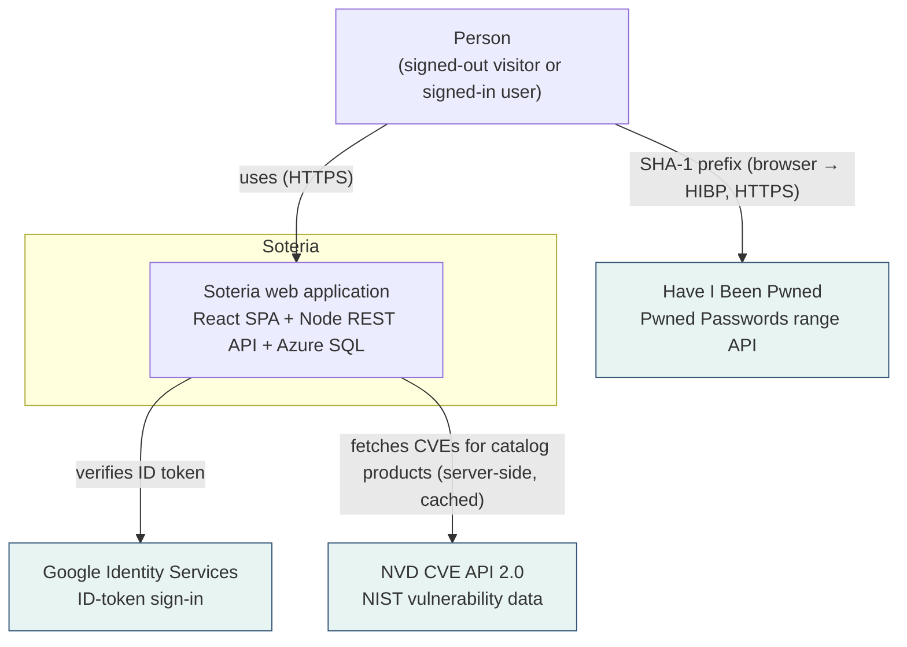
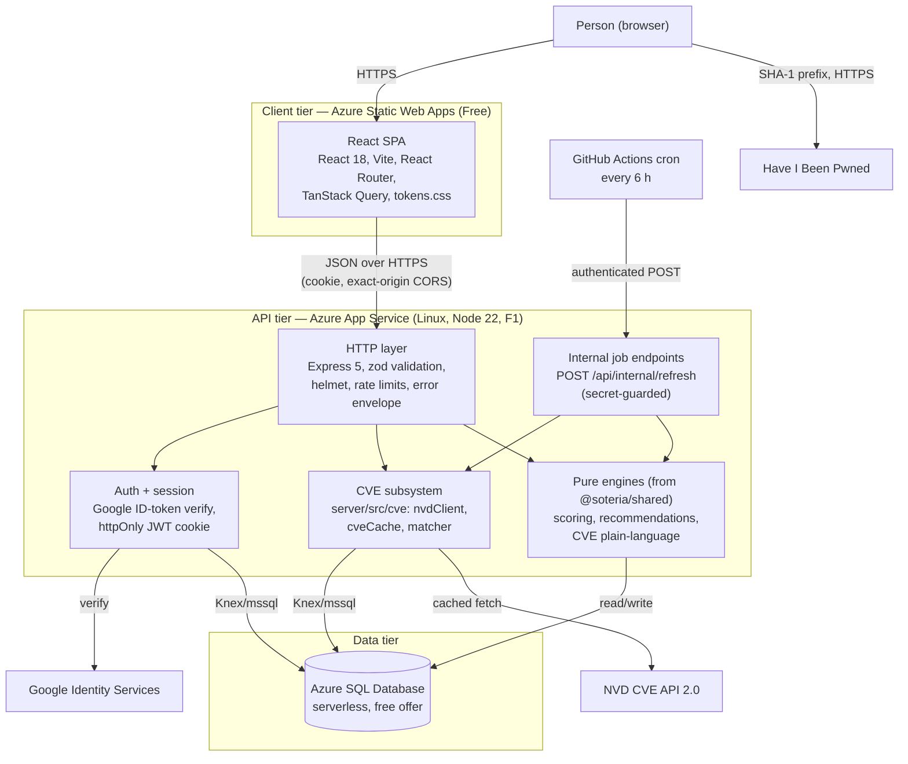
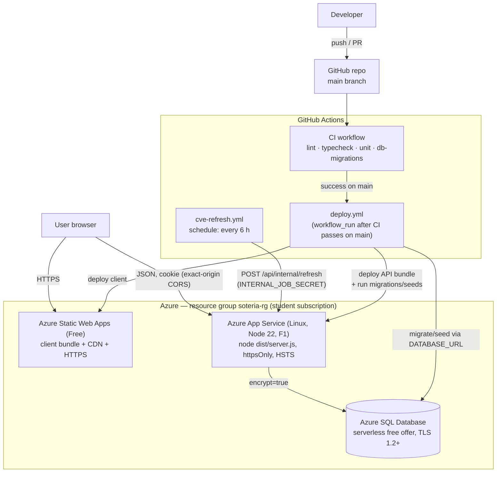

# Soteria architecture overview

Course artifact for **Milestone 3 (architectural design)**. It gives the system
context, the runtime containers, and the production deployment, and points to the
decisions behind them.

This document does not restate the schema, the API conventions, or the deploy
procedure. Where a detail belongs to one of those, it links out:

- Data model and privacy invariants → [`data-model.md`](data-model.md)
- Error envelope, validation, logging, rate limits, audit log →
  [`conventions.md`](conventions.md)
- Azure resources, secrets, deploy pipeline → [`deploy.md`](../deploy.md)
- Why each choice was made → [`adr/`](adr/README.md)
- Component-level design and sequence diagrams → [`components.md`](components.md)
- Noun/class list for CRC cards → [`classes.md`](classes.md)

## 1. What Soteria is

A personal cybersecurity posture assistant. A user can, anonymously, check a
password against breach data and generate strong passwords or passphrases. If
they sign in with Google, they can also answer a habits questionnaire to get
explainable category scores, build a software profile that is matched against
public CVE data, and work a prioritized list of recommendations with in-app
alerts when new vulnerabilities appear.

Two rules shape every diagram below (full list in
[`data-model.md`](data-model.md)):

- **Password-derived data never reaches the Soteria API.** Strength scoring is
  browser-local; the breach check goes from the browser straight to HIBP as a
  5-character SHA-1 prefix.
- **Account deletion cascades every user-owned row.**

## 2. System context

Notes:

- The browser talks to **HIBP directly**. The arrow does not pass through the
  Soteria application — that is the privacy invariant, not a simplification.
- Google is used only to verify identity; Soteria issues its own session cookie
  afterwards (see [ADR 0006](adr/0006-google-identity-no-passwords.md)).
- NVD is the one required external live data source
  ([ADR 0009](adr/0009-nvd-cve-api-external-data.md)); HIBP is a second live API
  but is browser-side ([ADR 0007](adr/0007-browser-only-hibp-breach-check.md)).

## 3. Container diagram

| Container              | Tech                            | Responsibility                                                                    |
| ---------------------- | ------------------------------- | --------------------------------------------------------------------------------- |
| React SPA              | React 18 + Vite                 | All UI; runs the browser-only password tools; calls the API for everything else.  |
| HTTP layer             | Express 5                       | Routing, zod validation, error envelope, rate limits, correlation ids, audit log. |
| Auth + session         | `google-auth-library`, JWT      | Verify Google ID token, upsert `users`, issue/verify the session cookie.          |
| CVE subsystem          | `server/src/cve/`               | Fetch and cache NVD data, match cached CVEs to a user's software.                 |
| Internal job endpoints | Express + `INTERNAL_JOB_SECRET` | Entry point for scheduled refresh + alert generation.                             |
| Pure engines           | `@soteria/shared`               | Scoring, recommendation, and CVE plain-language logic — no I/O.                   |
| Azure SQL Database     | SQL Server dialect              | System of record; see [`data-model.md`](data-model.md).                           |

## 4. Deployment diagram

Fixed points (see [`deploy.md`](../deploy.md) for the detail):

- `deploy.yml` triggers **only** on `workflow_run` after CI succeeds on `main` —
  never from a PR or a fork.
- The API is shipped as a self-contained bundle (compiled JS + production
  dependencies); App Service runs it with `SCM_DO_BUILD_DURING_DEPLOYMENT=false`.
- CORS is locked to exactly the Static Web App origin; there is no wildcard
  fallback, so a missing `WEB_ORIGIN` fails closed.
- Deploys are serialised by a `concurrency` group and gated by a required
  reviewer on the `production` environment.

## 5. Key decisions

Each row is an ADR in [`adr/`](adr/README.md). These were fixed in
[`IMPLEMENTATION_PLAN.md`](../plan/IMPLEMENTATION_PLAN.md) section 2 and are not
reopened here.

| #    | Decision                                                 |
| ---- | -------------------------------------------------------- |
| 0001 | npm-workspaces monorepo (`client` / `server` / `shared`) |
| 0002 | React 18 + Vite + strict TypeScript frontend             |
| 0003 | Node 22 + Express 5 + TypeScript backend                 |
| 0004 | Azure SQL Database via Knex + `mssql`                    |
| 0005 | Azure Static Web Apps + App Service (Linux) hosting      |
| 0006 | Google Identity sign-in; Soteria stores no passwords     |
| 0007 | Browser-to-HIBP k-anonymity breach check                 |
| 0008 | Client-side password strength with `@zxcvbn-ts/core`     |
| 0009 | NVD CVE API 2.0 as the required external live data       |
| 0010 | GitHub Actions cron for all scheduled work               |
| 0011 | Vitest + Supertest + Playwright + axe testing stack      |
| 0012 | Visual design derived from a fixed seed                  |

## 6. Runtime views by feature

| Feature area             | Primary containers                                            | Detail                                                                                                      |
| ------------------------ | ------------------------------------------------------------- | ----------------------------------------------------------------------------------------------------------- |
| Anonymous password tools | React SPA, HIBP (browser only)                                | [ADR 0007](adr/0007-browser-only-hibp-breach-check.md), [ADR 0008](adr/0008-client-side-strength-zxcvbn.md) |
| Sign-in                  | React SPA, Auth + session, Google, Azure SQL                  | [ADR 0006](adr/0006-google-identity-no-passwords.md)                                                        |
| Questionnaire + scoring  | React SPA, HTTP layer, scoring engine, Azure SQL              | [`components.md`](components.md) §1                                                                         |
| Software profile + CVEs  | React SPA, CVE subsystem, NVD, Azure SQL                      | [`components.md`](components.md) §2                                                                         |
| Recommendations          | React SPA, recommendation engine, Azure SQL                   | [`components.md`](components.md) §3                                                                         |
| Alerts                   | GitHub Actions cron, internal job, alert generator, Azure SQL | [`components.md`](components.md) §4                                                                         |
